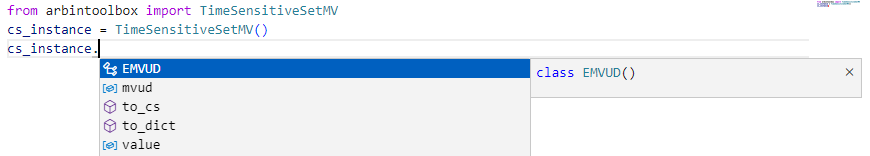

# Table of Contents
- [About](#about)
- [Requirements](#requirements)
- [Installation](#install-from-wheel-file)
- [Testing](#testing)
- [To-Do](#todo)

# About
Wrappers of C# objects, providing a smoother and more Pythonic programming experience for users who want to use ArbinCTI in Python.

## Usage Example 1: Command Arguments
When calling `public bool PostTimeSensitiveSetMV(IArbinSocket socket, TimeSensitiveSetMVArgs args)`, creating a `TimeSensitiveSetMVArgs` object in C# without the toolbox can be quite cumbersome. Here's an example:

### Without Toolbox
```python
import clr
clr.AddReference("ArbinCTI")

from System.Collections.Generic import List
from ArbinCTI.Core import TimeSensitiveSetMVArgs, TimeSensitiveSetMV

mv1 = TimeSensitiveSetMV()
mv1.MVUD  = TimeSensitiveSetMV.EMVUD.MVUD1
mv1.Value = 12.3

mv2 = TimeSensitiveSetMV()
mv2.MVUD  = TimeSensitiveSetMV.EMVUD.MVUD2
mv2.Value = 5.46

mv_list = List[TimeSensitiveSetMV]()
mv_list.Add(mv1)
mv_list.Add(mv2)

mv_channel1 = TimeSensitiveSetMVArgs.TimeSensitiveSetMVChannel(
    1,
    mv_list, 
    True
)

mv_args = TimeSensitiveSetMVArgs()
mv_args.Timeout = 5.0
mv_args.Channels.Add(mv_channel1)

control.PostTimeSensitiveSetMV(client, mv_args)
```

### With Toolbox
Using the toolbox, the same task becomes much simpler and more intuitive:

```python
from ctitoolbox import TimeSensitiveSetMVArgs, EMVUD

mv1 = TimeSensitiveSetMV(EMVUD.MVUD1, 12.3)
mv2 = TimeSensitiveSetMV(EMVUD.MVUD2, 4.56)

mv_channel1 = TimeSensitiveSetMVArgs.TimeSensitiveSetMVChannel(1, [mv1, mv2], True)

mv_args = TimeSensitiveSetMVArgs(5.0, [mv_channel1])

control.PostTimeSensitiveSetMV(client, mv_args.to_cs())
```

As you can see, the toolbox provides a smoother and more Pythonic way to interact with C# objects, making your code cleaner and easier to maintain.

Additional Benefits:
- **Keyword arguments** are allowed in this toolbox, compared to using `pythonnet` directly. 
- **Attributes are discoverable by Pylance**, reducing human error when programming. \
    

## Usage Example 2: Feedback Accessing
Upon receiving feedback data via a delegate, the toolbox makes accessing feedback data straightforward and user-friendly. The `to_dict` method converts feedback into a serializable format, easily transformable to JSON, with enum objects represented by their names. Additionally, the `__repr__` method of each object is defined, enabling quick inspection of the data.

<!-- ### Without Toolbox
```python
from ArbinCTI.Core import ArbinCommandBrowseDirectoryFeed

def OnBrowseDirectoryBack(feedback):
    if feedback.Result == ArbinCommandBrowseDirectoryFeed.BROWSE_DIRECTORY_RESULT.CTI_BROWSE_DIRECTORY_SUCCESS:


``` 

### With Toolbox -->
```python
from ctitoolbox import BrowseDirectoryFeedback

def OnBrowseDirectoryBack(feedback):
    feedback = BrowseDirectoryFeedback(feedback)

    # access attributes
    result_enum_value = feedback.result.value
    result_enum_name  = feedback.result.name
    for i in range(len(feedback.dir_file_info)):
        info = feedback.dir_file_info[i]
        t = info.type_
        p = info.parent_dir_path
        s = info.size
        l = info.last_modify_time

    # Inspect and export data
    if feedback.result == BrowseDirectoryFeedback.EResult.CTI_BROWSE_DIRECTORY_SUCCESS:
        # Print feedback instance as a JSON string
        print("Feedback instance:\n", feedback, "\n") 
        
        # Export feedback as a Python dictionary
        print("Python dictionary:\n", feedback.to_dict())
```

Output
```
Feedback instance
{
  "result": "CTI_BROWSE_DIRECTORY_SUCCESS",
  "dir_file_info": [
    {
      "type": 1,
      "parent_dir_path": "file1.txt",
      "size": 2048,
      "last_modify_time": "2024-01-01T12:00:00"
    },
    {
      "type": 0,
      "parent_dir_path": "folder1",
      "size": 0,
      "last_modify_time": "2024-01-02T15:30:00"
    }
  ]
}

Python dictionary: 
{'result': 'CTI_BROWSE_DIRECTORY_SUCCESS', 'dir_file_info': [{'type': 1, 'parent_dir_path': 'file1.txt', 'size': 2048, 'last_modify_time': '2024-01-01T12:00:00'}, {'type': 0, 'parent_dir_path': 'folder1', 'size': 0, 'last_modify_time': '2024-01-02T15:30:00'}]}
```


# Requirements
- 64-bit Python >= 3.7
- System
    - Windows: .NET Framework >=4.7.2
    - Linux: Mono is used by default

# Install from wheel file
`pip install path/to/ctitoolbox-python-0.1.0-py3-none-any.whl`

# Testing
Run unittest
```sh
python -m unittest
```

To view feedback output while running test, set env variable before running unittest:
- Windows Powershell
    ```sh
    $env:UNITTEST_VIEW_DICT="True"
    ```
- Linux Cmd
    ```sh
    UNITTEST_VIEW_DICT="True"
    ```

# To-Do
- Abstract feedback classes: base class with `to_dict` and `__repr__` definition.
- `CSTypeConvertor.to_cs_list` supports various types of iterables.
    - `PostApplyForUDPCommunication`: `List<CMetavariableDataCodeApply>`
